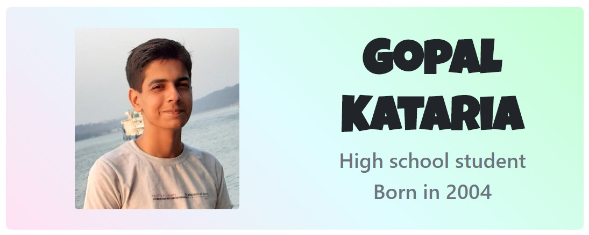

## About me 

**I am a high school student and a self-taught programmer.** While my main focus is web development, I love trying my hand at new languages, software and frameworks. My ultimate goal is to build something transformative for the society using my programming skills.

I have a good experience with front-end languages (HTML, CSS, Javascript) and frameworks (React, Next.js, Bootstrap, Ionic) along with great knowledge of Python.Feel free to [contact me]( https://gopalkataria.web.app/) with your requirements, I will do all my best to come upto more than your expectations.

